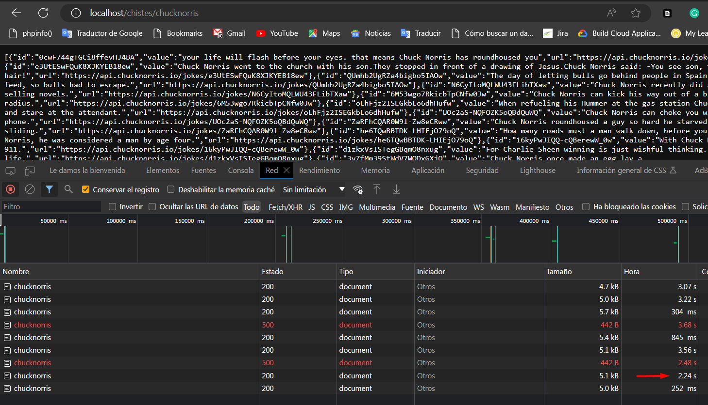

# Live Coding - Christian Sum

---

Porfavor seguir las siguientes instrucciones 

1. Abrir PowerShell(Windows) en la ruta del proyecto actual y ejecutar: `mvn clean install` 
2. En la misma ventana abierta del paso 1, ejecutar: `docker build -t chistes-api-docker .`
3. En la misma ventana abierta del paso 1, ejecutar: `docker run --name chistesContainer -p 80:80 -d chistes-api-docker:latest`

